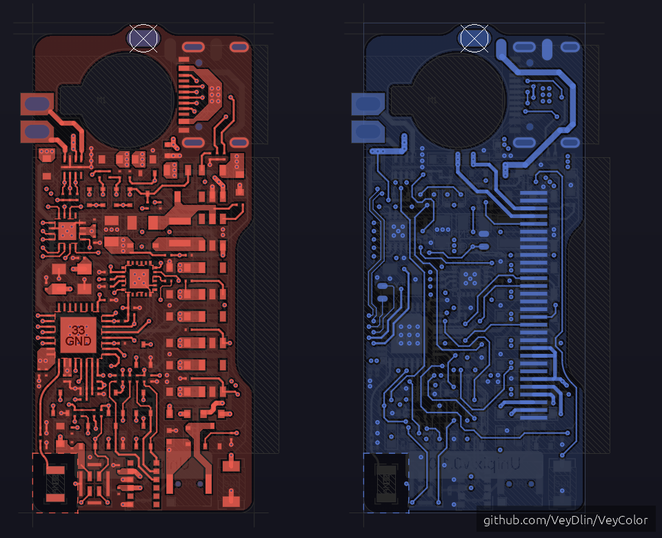

# VeyColor

## Color Palette

| Layer Name | Color |
|:-----------|:-----:|
| Top Layer |  |
| Mid Layer 1 |  |
| Mid Layer 2 |  |
| Mid Layer 3 |  |
| Mid Layer 4 |  |
| Mid Layer 5 |  |
| Mid Layer 6 |  |
| Mid Layer 7 |  |
| Mid Layer 8 |  |
| Mid Layer 9 |  |
| Mid Layer 10 |  |
| Mid Layer 11 |  |
| Mid Layer 12 |  |
| Mid Layer 13 |  |
| Mid Layer 14 |  |
| Mid Layer 15 |  |
| Mid Layer 16 |  |
| Mid Layer 17 |  |
| Mid Layer 18 |  |
| Mid Layer 19 |  |
| Mid Layer 20 |  |
| Mid Layer 21 |  |
| Mid Layer 22 |  |
| Mid Layer 23 |  |
| Mid Layer 24 |  |
| Mid Layer 25 |  |
| Mid Layer 26 |  |
| Mid Layer 27 |  |
| Mid Layer 28 |  |
| Mid Layer 29 |  |
| Mid Layer 30 |  |
| Bottom Layer |  |
| Top Overlay |  |
| Bottom Overlay |  |
| Top Solder Mask |  |
| Bottom Solder Mask |  |
| Internal Plane 1 |  |
| Internal Plane 2 |  |
| Internal Plane 3 |  |
| Internal Plane 4 |  |
| Internal Plane 5 |  |
| Internal Plane 6 |  |
| Internal Plane 7 |  |
| Internal Plane 8 |  |
| Internal Plane 9 |  |
| Internal Plane 10 |  |
| Internal Plane 11 |  |
| Internal Plane 12 |  |
| Internal Plane 13 |  |
| Internal Plane 14 |  |
| Internal Plane 15 |  |
| Internal Plane 16 |  |
| Keep Out Layer |  |
| Mechanical Layer 1 |  |
| Mechanical Layer 2 |  |
| Mechanical Layer 3 |  |
| Mechanical Layer 4 |  |
| Mechanical Layer 5 |  |
| Mechanical Layer 6 |  |
| Mechanical Layer 7 |  |
| Mechanical Layer 8 |  |
| Mechanical Layer 9 |  |
| Mechanical Layer 10 |  |
| Mechanical Layer 11 |  |
| Mechanical Layer 12 |  |
| Mechanical Layer 13 |  |
| Mechanical Layer 15 |  |
| Mechanical Layer 16 |  |
| Drill Drawing |  |
| Multi Layer |  |
| BackGround |  |
| DRC Errors |  |
| Pad Hole Layer |  |
| Via Hole Layer |  |
| Dielectric Layer 1 |  |
| Bottom Pad Master |  |
| Top Pad Master |  |
| Dielectric Layer 2 |  |
| Dielectric Layer 3 |  |
| Mechanical Layer 17 |  |
| Mechanical Layer 21 |  |
| Mechanical Layer 25 |  |
| Mechanical Layer 29 |  |
| Mechanical Layer 18 |  |
| Mechanical Layer 19 |  |
| Mechanical Layer 20 |  |
| Mechanical Layer 22 |  |
| Mechanical Layer 23 |  |
| Mechanical Layer 24 |  |
| Mechanical Layer 26 |  |
| Mechanical Layer 27 |  |
| Mechanical Layer 28 |  |
| Mechanical Layer 30 |  |
| Mechanical Layer 31 |  |
| Mechanical Layer 32 |  |
| Dielectric Layer 4 |  |
| Dielectric Layer 5 |  |
| Mechanical Layer 14 |  |
