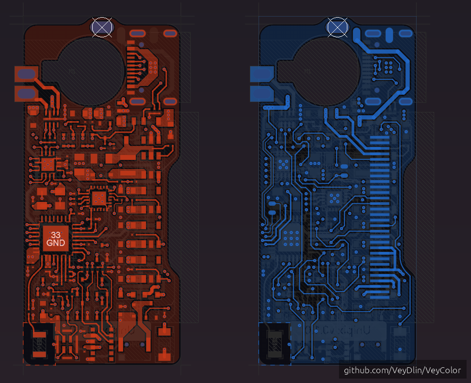
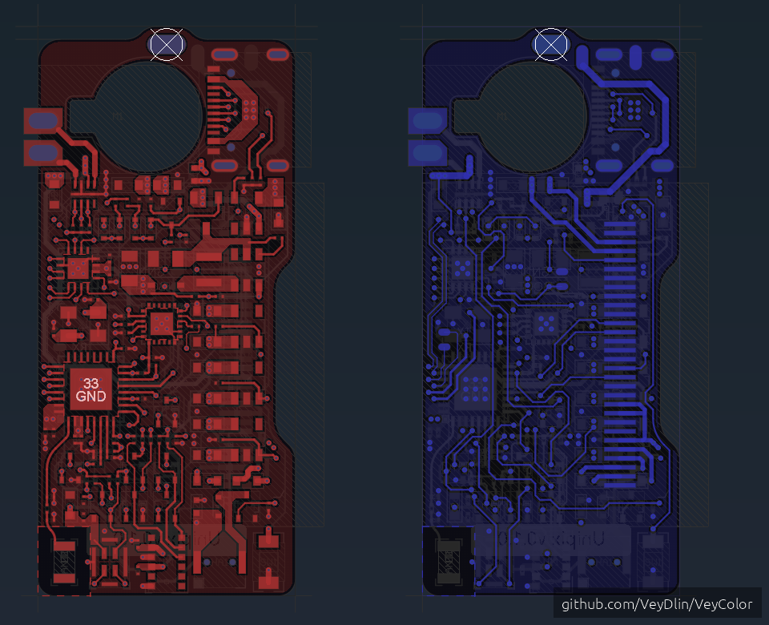
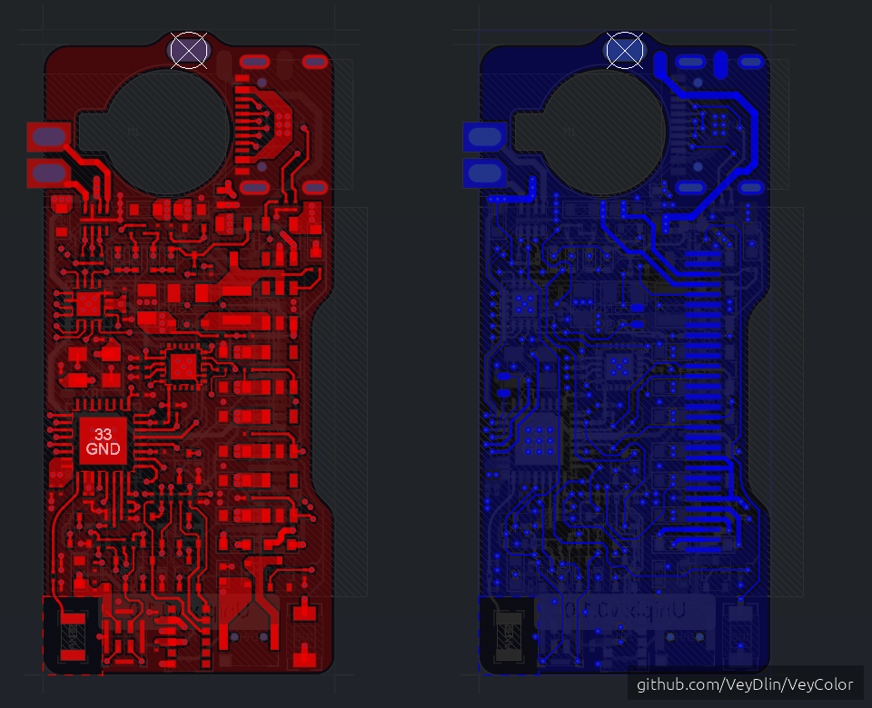
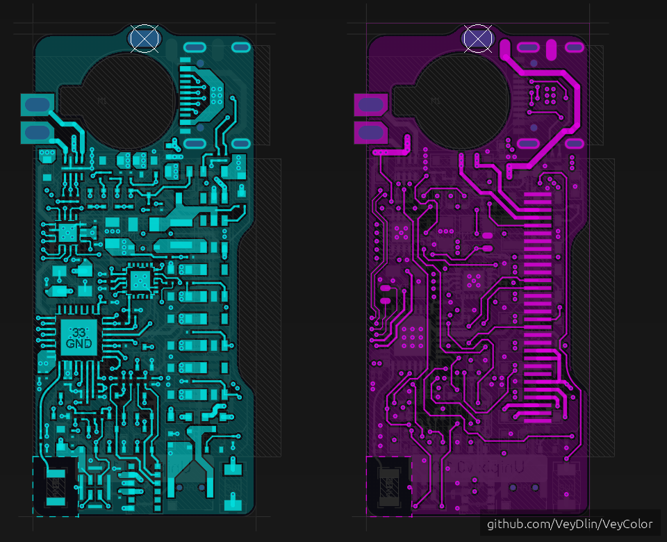
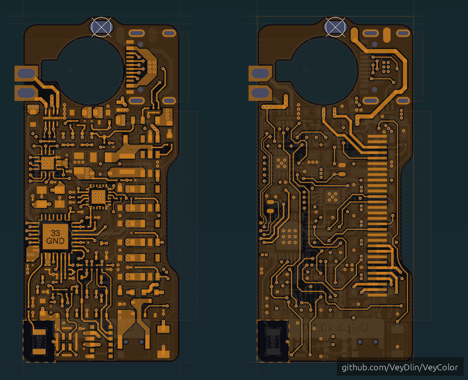
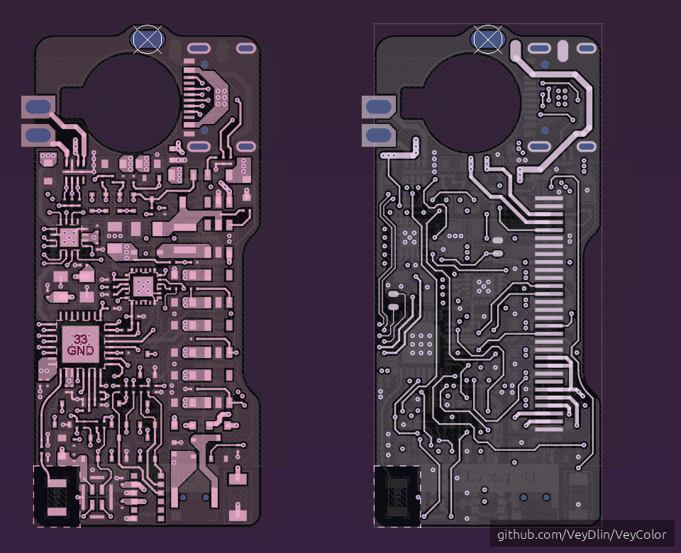

# VeyColor - Altium Designer Color Schemes

A curated collection of professional PCB layer color schemes for Altium Designer, optimized for clarity, aesthetics, and long work sessions.

## Installation

1. Download the desired `.PCBSysColors` file
2. In Altium Designer: **Tools** → **Preferences** → **PCB Editor** → **Layer Colors**
3. Click **Load color profile** and select the downloaded file

## Main Versions

### VeyColor2

Main balanced scheme for daily use with improved contrast.

### VeyColor2 CoolTones

Cool color palette with blues and cyans, easy on the eyes.

### VeyColor2 PastelNeutral

Soft pastel colors designed for extended work sessions.

### VeyColor2 Balanced

Neutral moderate saturation for a professional appearance.

## Remix Versions

### VeyColor2 Classic

Bright saturated colors, perfect for presentations and screenshots.

## Experimental Versions

### VeyColor2 Cyberpunk

Experimental neon colors on dark background for a futuristic look.

### VeyColor2 Realistic

Realistic PCB appearance with traditional green solder mask.

### VeyColor2 Pink

Aesthetic pastel lavender-pink theme.

## Old Versions

### VeyColor

Classic balanced scheme - the foundation of the collection.